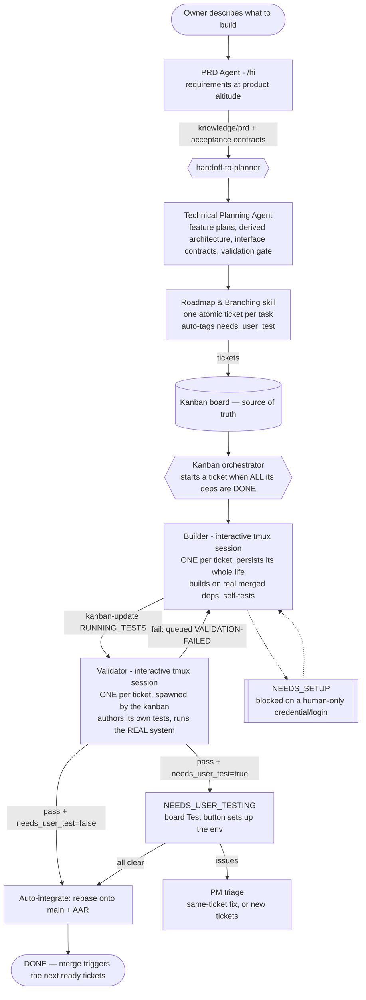

# software_factory_cc

A software factory: a pipeline of Claude agents that turns a non-technical person's request
into shipped, tested software. Clone the repo, open Claude Code inside it, type `/hi`.

```bash
git clone https://github.com/BrennanOwYong/software_factory_cc.git my-project
cd my-project
claude .
# then type: /hi
```

## How the factory works



Each box is a separate context by design: product intent, technical planning, building, and
validation never share a window. The kanban ticket file is the single source of truth for state;
the builder and validator drive it via `kanban-update`. A human is touched at exactly two points —
**infra setup** (a credential only they hold) and **user testing** (taste) — and nowhere else.

### The core loop, in words

1. **Roadmap → tickets.** The planner decomposes the plan into atomic tickets, each carrying its
   dependencies, filled interface contracts, and an auto-set `needs_user_test` tag (true when the
   task produces something a person judges by feel; false for pure plumbing).
2. **Dependency-ordered start.** A ticket starts only once **every ticket it depends on is DONE and
   merged** — so it branches from a main that already contains real, working dependencies and can
   actually run end-to-end. Dep-free tickets go first; a dependent starts the moment its last
   dependency finishes. Independent tickets run in parallel.
3. **One builder per ticket, for the ticket's whole life.** It's an interactive tmux session (never
   headless) that keeps its context — what it built, what it learned — across every round. It marks
   `IN_PROGRESS`, builds, self-tests, and sets `NEEDS_SETUP` (with an exact remark) only if it hits
   something only a human can provide.
4. **Builder → RUNNING_TESTS → the kanban spawns the validator.** When the build is ready the builder
   sets `RUNNING_TESTS`; the kanban reacts by spawning (first round) or messaging (later rounds) the
   ticket's own persistent validator. The validator reads the ticket and decides its approach — write
   a test script, drive the live site, or a mix — and runs against the **real running system**, not a
   mock. Fail → it queues `VALIDATION-FAILED` back to the same builder → fix → `RUNNING_TESTS` again.
5. **The one branch — `needs_user_test`.** On a passing verdict: false → auto-integrate to `DONE`;
   true → park at `NEEDS_USER_TESTING`, where the board's Test button sets up the environment for you.
   Your "all clear" integrates it; reported issues route to the PM agent, which decides whether the
   same builder fixes it or it needs new tickets.
6. **Completion drives the next.** Each merge re-checks which tickets just had their last dependency
   satisfied and starts them. The loop runs until every ticket is `DONE`.

### Agent-to-agent messaging (why it doesn't stall)

Agents never type into each other directly. A message is **enqueued by a tool call** into the
recipient's inbox. Claude Code's native **Stop hook** — the "this agent is completely done with its
turn" signal — fires and drains the next queued message into the now-idle session. Delivering only
into a genuinely idle session, on the assumption each message one-shots its task, is what keeps the
loop from stalling. This is why tight ticket breakdown matters: one message should equal one clean
turn.

## Status vocabulary

```
NOT_STARTED  →  IN_PROGRESS  →  RUNNING_TESTS  →  NEEDS_USER_TESTING  →  DONE
                     │                                  (skipped when
                     └── NEEDS_SETUP ──┘                 needs_user_test=false;
                     (human provides a                   auto-integrates to DONE)
                      credential, then resumes)
```

- **NOT_STARTED** — ticket created; waiting for its dependencies to finish.
- **IN_PROGRESS** — the builder is building and self-testing.
- **NEEDS_SETUP** — blocked on something only a human holds (a login, an account, a key). The builder
  states exactly what it needs; you provide it; the builder resumes.
- **RUNNING_TESTS** — the builder is done; the validator is independently testing the real system.
- **NEEDS_USER_TESTING** — validated (function, performance, requirements). Only taste remains; the
  board Test button is live. Non-user-test tickets never enter this state.
- **DONE** — integrated onto main. Its completion starts any tickets that were waiting on it.

## Prerequisites

**tmux** is required — every builder and validator is a tmux session.

```bash
tmux -V                       # check it's installed
sudo apt install tmux         # Ubuntu / Debian / WSL
brew install tmux             # macOS
```

You do **not** need to be inside a tmux session yourself; the factory spawns its own. Also required:
- **Node.js 18+** — for the kanban board UI
- **Claude Code CLI** — installed and authenticated
- **WSL2 or Linux** — Windows native not supported

## How it activates

`CLAUDE.md` and `.claude/settings.json` at the repo root are picked up automatically. On session
start, `bin/factory-init.sh` runs, detects `factory.json`, and puts the session into coordinator
mode. Product code is built in its own git repo (convention: `<project>/product`) — never in the
factory tree.

## Kanban board UI

```bash
KANBAN_PROJECT_ROOT=/path/to/your/project node kanban-ui/server.js
```

Opens at `http://localhost:2999`. Shows every ticket by status. Clicking a ticket opens its
per-feature sub-PRD. User-test tickets show a **Test** button that sets up that ticket's environment
so you only ever click one thing; backend tickets show status only. The board reloads only when a
ticket actually changes.

## Kanban scripts (`bin/`, added to PATH on first run)

| Script | Who calls it | What it does |
|---|---|---|
| `kanban-create <issue> --feature <name> [opts]` | Planner (roadmap skill) | Creates one ticket with all roadmap data — deps, infra, links, intent, success, `--needs-user-test`, `--landing-url`; scaffolds contract stubs |
| `kanban-graph` | Planner / anyone | Build waves + cycle / dangling-dep / infra check over the ticket graph |
| `kanban-dispatch` | Kanban orchestrator | Starts a builder for every ticket whose dependencies are all DONE (idempotent; re-runs on each completion) |
| `spawn-builder.sh` | kanban-dispatch | Creates the worktree (branched from merged main) + tmux session for a ticket's builder |
| `spawn-agent <name> ["msg"]` | Kanban / agents | Spawns/points a planning or validator agent session; allocates the ticket's test port on a `VALIDATE:` kickoff |
| `kanban-update <issue> <status> [notes]` | Builder | Moves the ticket through the state machine; on RUNNING_TESTS the kanban spawns the validator; routes by `needs_user_test` |
| `kanban-port <issue>` | Validator spawn path | Allocates the ticket's serving port on demand |
| `rebase-queue <issue>` | On approval / auto | Serial-rebases the ticket's branch onto main, one at a time, then writes the AAR |
| `kanban-aar <issue>` | rebase-queue | Writes the after-action report and mines repeated steps |
| `kanban-check` / `kanban-perf` / `kanban-eval` | Anyone | Board state / timing / quality reports |
| `tmux-delegate <agent> <msg>` | Agents / scripts | Enqueues a message; the recipient's Stop hook injects it when idle |
| `factory-init.sh` | SessionStart hook | Registers the coordinator, installs post-merge hooks |

`PIPELINE.md` holds the full flow diagram, the verified producer/consumer joint table, and per-agent
test procedures — read it before changing any handoff.

## File layout (per project)

```
project-root/
  factory.json              # activates factory mode
  product/                  # the product's OWN git repo — all product code lives here
  worktrees/                # one builder worktree per in-flight ticket
  kanban/
    <issue>.md              # one ticket — the source of truth for its state
    validation/<issue>.md   # the validator's per-assertion verdicts
    aar/                    # after-action reports (written at integration)
    inbox/, agents/         # message queues + agent idle/busy state
    telemetry.jsonl         # event log for kanban-perf
  knowledge/
    prd/product.md          # the single living PRD (one section per feature)
    architecture.md         # the derived architecture + ADRs
    spec/                   # per-feature technical plans
    contracts/              # acceptance contracts + interface contracts between tickets
    technical/research/     # the planner's research the builders read instead of re-researching
    lessons.md              # mined builder learnings
```

## Development

`scripts/smoke-test.sh` exercises the deterministic layer end to end with stubbed agents
(`CLAUDE_BIN=true`) — run it after any plumbing change. Deferred/parked ideas live in
`knowledge/KIV.md`.
